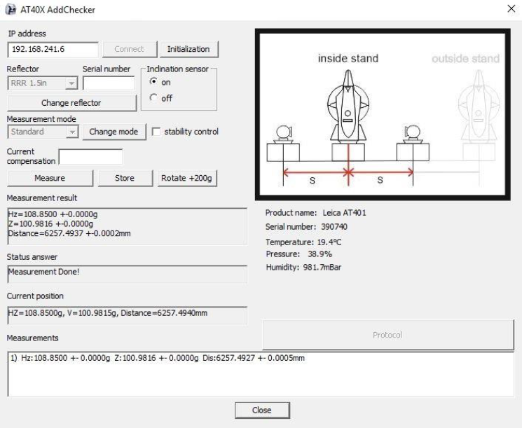

# Metrological application
#####  metrological application written in CPP with MFC  
this application is part of the master's thesis written in 2019    
Check it there: [Full text (in Czech language)](https://dspace.cvut.cz/bitstream/handle/10467/83576/F1-DP-2019-Kudela-Petr-Optimalizace_mericke_zakladny.pdf?sequence=-1&isAllowed=y) 

#### Application knows to:
* connect to station
* initialization to get the most accurate results
* measure distances and angles in real time
* measure meteo data
* store data
* select supported reflectors
* select supported measurement modes
* turn on or off inclination sensor (to avoid repeated inicialization)
* guide the user through the measurement procedure
* generate well-arranged protocol with all necessary values

##### How the app looks like:  

